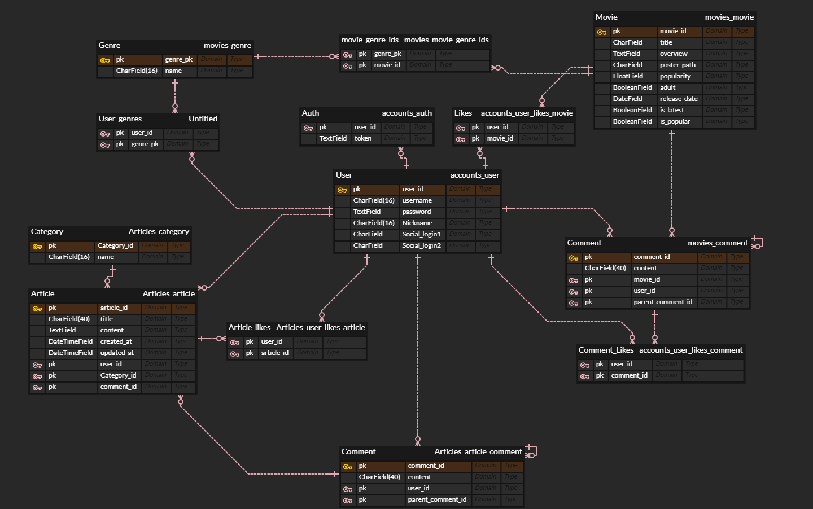

# Final-pjt
- 개발 목적 : 기존에 좋은 코드, 좋은 사이트를 봐야 좋은 코드를 작성할 수 있다고 생각하여 넷플릭스를 클론 코딩하려고 했지만 명세를 받고 프로젝트의 의도와 맞지 않다고 생각하여 넷플릭스의 큰 틀을 따라가되 OTT가 아닌 커뮤니티 웹을 만들어보려고 한다.  

## Team Name : Plus + 
## App Name : FliXquare

## https://verbena-marjoram-995.notion.site/Final-Project-aa3eaefea3ef421d97ef60f7bf798a72?pvs=4

## 그라운드 룰
  1. 아침 회의 9시부터 (1시정도) 
  2. 마감 회의 17시부터 (30분정도),5시 이후 code 작성 금지
  3. 17시 반부터 개인 정리 및 README 작성
  4. 18시 이후 개인적으로 코드 작성 시 다음 날 오전 회의에서 진행 상황 공유(본인은 했는데 안했다고 화X, 하지만 본인 역할은 충실히 하기)
  5. 쉬는 시간은 개인적으로

## 개발 도구 

### Front-End 
  - HTML/CSS
  - JavaScript
  - Vue.js

### Back-End
  - Python
  - Django
  - MySQL

## 협업 도구
  - Git
  - Notion
  - figma

## 페이지 구성

div v-show=”is_authenticated”로 제어할 것임.

### ! 비로그인 페이지 (구성 완)

- **네비게이션 바 (메인 페이지, 회원가입 페이지, 로그인 페이지)**
    - MainView (HomeView) → (Components) Main Info, sub info (App info 1, 2, 3)
        - **MainInfo : “당신의 영화 여정을 함께할 커뮤니티”**
            - 최신 영화 소식, 리뷰, 토론 그리고 더 많은 것들을 즐기세요.
        - **SubInfo1 : “최신 인기영화를 한눈에!”**
            - 최신 흥행작부터 기대작 예고, 각종 영화 이야기까지 한눈에! 유저 기반 다양한 영화 소식을 쉽고 빠르게 접할 수 있습니다!
        - **SubInfo2 : “”**
            - 
        - **SubInfo2 : “”**
            - 
    - SignupView (SignupView) → (Components) Signup Form 활용(submit 이후 router.push) [ Children : Genre_select / user-genre table을 통해서 유저 맞춤 추천 장르 3개 선택 ]
    - LoginView (LoginView) → (Components) Login Form 활용

### ! 로그인 페이지

- **네비게이션 바 (메인 페이지, 최신 영화 리스트, 인기 영화 리스트, 찜한 목록, 프로필)**
    - MainView (MovieView) → (Components) UserRecommend, Latest, Top 10, Genre 1, 2, 3
    - LatestView (LatestView) → (Components) Page 당 10 영화 렌더
    - PopularView (PopularView) → (Components) Page 당 10 영화 렌더 (기존 MovieList + 좋아요 우선 순위)
    - FavoriteView(FavoriteView) → (Components) Page 당 10 영화 렌더 (기존 찜 목록 추가, 제거 방식)
    - ArticlesView(ArticlesView) → (Components) 자유게시판, 리뷰게시판
    - ProfileView (ProfileView) → MainInfo(Components), InfoUpdate(View), GenreUpdate(View), StoreView(RouteLink)
        - 내 글 보기(Components)

- **MainView**
    - 메인 페이지의 메인 컴포넌트 : **“오늘을 기준으로 일주일 전까지의 반응이 많은 영화들 중 제일 반응이 많은 영화[0]”**
    1. **DB preference (장르 선호도)**
        - **전체 유저 좋아요 10선** > (1 섹션) : 처음에 불러올 때, “**Main Movie List DB” (좋아요 : 0 일때, Popularity기준으로 정렬, 이후 “좋아요” 우선 순위)** (10)
        - **유저 별 추천 영화** (1 섹션) > **“사용자 추천 알고리즘 - AI가 추천하는 알고리즘(내가 좋아하는 장르는 “ㅇ, ㅇ, ㅇ”)과 인기도(Popularity)를 기준으로”** (18)
        - **최신 영화** > (1 섹션) : 처음에 불러올 때, **Now Playing DB(좋아요 : 0 일때, Popularity기준으로 정렬, 이후 “좋아요” 우선 순위)** (18)
        - **선호도 장르** > (3 섹션) : 장르 목록에서 > 장르 3개를 “**Main Movie List DB “(좋아요 : 0 일때, Popularity기준으로 정렬, 이후 “좋아요” 우선 순위)** (18)
- **DetailModalView**
    - 영화 상세 페이지를 보았을 때, DetailInfo 보여주기 (예고편, Title, Content, Rate, likes, comments)
    - 반응(Comment) 작성 기능 있음

## 1. 팀원 정보 및 업무 분담 내역 (24.05.16 진행)
  - **반응형 웹 디자인 : 박민철**
  - **UserDB,CommentDB : 이주호**
  - **MovieDB(Now Playing, Popular),GenreDB : 박민철**
  - **비로그인 페이지 + 프로필 설정 View,Components : 이주호**
  - **로그인 페이지(Movie List, Now Playing, Popular)View,Components : 박민철**
  - **Notion 작성 : 박민철**
## 2. 목표 서비스 구현 및 실제 구현 정도 (24.05.18 ~ 기한 전까지 진행) [주말에도 진행 가능]
- [x]  (24.05.02 전체적인 PJT 이해 회의)
- [x]  (24.05.13 전체적인 PJT 이해 회의)
    
    다음에 회의할 내용 : 페이지 구성, DB Table (ERD 구성) 
    
- [x]  (24.05.16 전체적인 PJT 이해 회의)
    - [x]  프로젝트 설계 하기
        - [x]  Main DB, Sub DB (TMDB)
        - [ ]  유저 추천 알고리즘 설계 (유저 추천 알고리즘을 작성 못함)
        - [x]  전체 URL 구성 (routing)
        - [x]  페이지 전체 구성 (Views, Components) [BE]
    - [x]  DB ERD 구성 (프로필, 영화 별 반응(댓글))
    - [x]  일정 계획 상세 작성 : (책임자 분류) (★★★★★)
    - [x]  개인적으로 SQL-D 공부하기 (★★★★ << 이거 진짜 중요 (5만원 나감))
- [x]  (24.05.17 전체적인 PJT 이해 회의)
    - [x]  전체 URL, Views, Components 구성 보충 (routing)
    - [x]  전체 DB ERD 구성 (전체 영화 리스트, …)
    - [x]  Detail URL 구성, UI/UX 구성 (CSS, HTML Form)
    - [x]  AI 사용처 구상 (Chatbot? 어떻게 활용???)
    - [x]  유저 추천 알고리즘 설계 (★★★★) (필수적!!!) → JS setTimeout(), watch 혹은 computed를 사용해서 계속 호출 못하게
    - [x]  Movie List DB 긁어다가 fixture화 시키기 (여유 있으면 // 더미 생성 완료)
- [ ]  (24. 05. 18 ~ 19 주말 간 진행)
    - [ ]  ㅇㄹ
    - [ ]  ㅇㄹ
    - [ ]  ㅇㄹ
    - [ ]  ㅇㄹ
    - [ ]  ㅇㄹ
    - [ ]  

---

- [ ]  (24.05.20 주말 간 진행사항 공유, 오늘 진행할 리스트 업)
    - [ ]  주말 간 진행사항 확인 (목업 마무리된 거 확인하기)
    - [ ]  서로 비로그인, 로그인 페이지 구성하기
        - [ ]  비로그인 페이지 진행사항 ::
        - [ ]  로그인 페이지 진행사항 ::
## 3. 데이터베이스 모델링 (ERD) (24.05.17 진행)

## 4. 영화 추천 알고리즘에 대한 기술적 설명 (24.05.17~기한 전까지 진행)

## 5. 핵심 기능에 대한 설명 (24.05.16 진행 ~ 기한 전까지 세부 기능 추가)

## 6. 기타 (느낀점, 후기 등)

## 7. ~~배포 서버 URL (배포했을 경우) 

## ❖이 외의 내용은 자유롭게 작성 가능~~
### 도전
- 검색
- 백준 코드 그룹 같은거