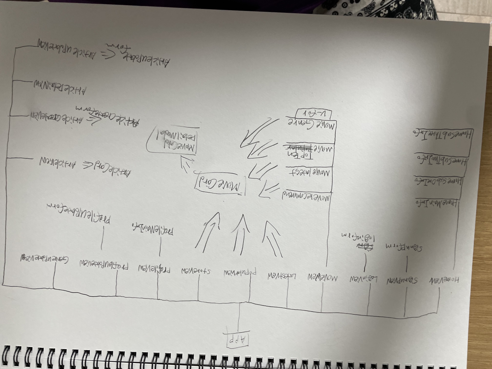
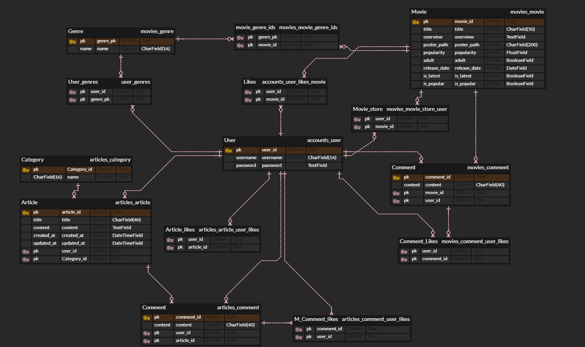

# Final-pjt
- 개발 목적 : 기존의 소통이 불가했던 OTT 사이트에 커뮤니티,댓글 기능을 추가하여 소통을 하며 정보를 교환할 수 있게 함.
## Team Name : Plus + 
## App Name : FliXquare
## 노션
## https://verbena-marjoram-995.notion.site/Final-Project-aa3eaefea3ef421d97ef60f7bf798a72?pvs=4
## 노션(일정)
## https://www.notion.so/98e30b9be50d48beb3a8d86a704c1e7f?pvs=4
## 그라운드 룰
  1. 아침 회의 9시부터 (1시정도) 
  2. 마감 회의 17시부터 (30분정도),5시 이후 code 작성 금지
  3. 17시 반부터 개인 정리 및 README 작성
  4. 18시 이후 개인적으로 코드 작성 시 다음 날 오전 회의에서 진행 상황 공유(본인은 했는데 안했다고 화X, 하지만 본인 역할은 충실히 하기)
  5. 쉬는 시간은 개인적으로

## 개발 도구 

### Front-End 
  - HTML/CSS
  - JavaScript
  - Vue.js

### Back-End
  - Python
  - Django
  - MySQL

## 협업 도구
  - Git
  - Notion
  - figma

## 페이지 구성
### Router and Component

| Path | Component | Desciption | Child-Component |
| --- | --- | --- | --- |
| / | HomeView | 시작 페이지 | HomeMainInfo, HomeSubOneInfo,HomeSubTwoInfo,HomeSubThreeInfo |
| /signup | SignupView | 회원 가입 페이지 | SignupForm |
| /login | LoginView | 로그인 페이지 | LoginForm |
| /movie | MovieView | 메인 페이지 | MovieRecommend,MovieLatest,MovieTopTen,MovieGenre,MovieCard,MovieCardDetailModal |
| /latest | LatestView | 최신 영화 페이지 | MovieCard,MovieCardDetailModal |
| /popular | PopularView | 인기 영화 페이지 | MovieCard,MovieCardDetailModal |
| /profile | ProfileView | 프로필 페이지 | ProfileMainInfo |
| /profileupdate | ProfileUpdateView | 프로필 수정 페이지 | ProfileUpdateForm |
| /genreupdate | GenreUpdateView | 장르 선택/수정 페이지 |  |
| /store | StoreView | 내 찜 목록 페이지 | MovieCard,MovieCardDetailModal,MovieCardDetailModalLikeButton,MovieCardDetailModalCommentLikeButton,MovieCardDetailModalStoreButton,MovieCardDetailModalCommentUpdateForm |
| /articles | ArticlesView | 커뮤니티 메인 페이지 | ArticleCard |
| /articlecreate | ArticleCreateView | 게시글 생성 페이지 | ArticleCreateForm |
| /articledetail/:articleId | ArticleDetailView | 게시글 상세 정보 페이지 | ArticleDetailComment,ArticleDetailCommentCreateForm,ArticleDetailLikeButton,ArticleDetailCommentLikeButton,ArticleDetailCommentUpdateForm |
| /articleupdate/:articleId | ArticleUpdateView | 게시글 수정 페이지 | ArticleUpdateForm |

### ! 비로그인 페이지 (구성 완)

- **네비게이션 바 (메인 페이지, 회원가입 페이지, 로그인 페이지)**
    - MainView (HomeView) → (Components) Main Info, sub info (App info 1, 2, 3)
        - **MainInfo : “당신의 영화 여정을 함께할 커뮤니티”**
            - 최신 영화 소식, 리뷰, 토론 그리고 더 많은 것들을 즐기세요.
        - **SubInfo1 : “최신 인기영화를 한눈에!”**
            - 최신 흥행작부터 기대작 예고, 각종 영화 이야기까지 한눈에! 유저 기반 다양한 영화 소식을 쉽고 빠르게 접할 수 있습니다!
        - **SubInfo2 : “민철 주호 Let's Go”**
            - 광주 1반 최고
        - **SubInfo2 : “무엇을 넣어야할까”**
            - 무엇을... 무엇을 ... 무엇을 ...
    - SignupView (SignupView) → (Components) Signup Form 활용(submit 이후 router.push) [ Children : Genre_select / user-genre table을 통해서 유저 맞춤 추천 장르 3개 선택 ]
    - LoginView (LoginView) → (Components) Login Form 활용

### ! 로그인 페이지

- **네비게이션 바 (메인 페이지, 최신 영화 리스트, 인기 영화 리스트, 찜한 목록, 프로필)**
    - MainView (MovieView) → (Components) UserRecommend, Latest, Top 10, Genre 1, 2, 3
    - LatestView (LatestView) → (Components) Page 당 18 영화 렌더
    - PopularView (PopularView) → (Components) Page 당 18 영화 렌더 (기존 MovieList + 좋아요 우선 순위)
    - FavoriteView(FavoriteView) → (Components) Page 당 18 영화 렌더 (기존 찜 목록 추가, 제거 방식)
    - ArticlesView(ArticlesView) → (Components) 자유게시판, 리뷰게시판
    - ProfileView (ProfileView) → MainInfo(Components), InfoUpdate(View), GenreUpdate(View), StoreView(RouteLink)
        - 내 글 보기(Components)

- **MainView**
    - 메인 페이지의 메인 컴포넌트 : **“오늘을 기준으로 일주일 전까지의 반응이 많은 영화들 중 제일 반응이 많은 영화[0]”**
    1. **DB preference (장르 선호도)**
        - **전체 유저 좋아요 10선** > (1 섹션) : 처음에 불러올 때, “**Main Movie List DB” (좋아요 : 0 일때, Popularity기준으로 정렬, 이후 “좋아요” 우선 순위)** (10)
        - **유저 별 추천 영화** (1 섹션) > **“사용자 추천 알고리즘 - AI가 추천하는 알고리즘(내가 좋아하는 장르는 “ㅇ, ㅇ, ㅇ”)과 인기도(Popularity)를 기준으로”** (18)
        - **최신 영화** > (1 섹션) : 처음에 불러올 때, **Now Playing DB(좋아요 : 0 일때, Popularity기준으로 정렬, 이후 “좋아요” 우선 순위)** (18)
        - **선호도 장르** > (3 섹션) : 장르 목록에서 > 장르 3개를 “**Main Movie List DB “(좋아요 : 0 일때, Popularity기준으로 정렬, 이후 “좋아요” 우선 순위)** (18)
- **DetailModalView**
    - 영화 상세 페이지를 보았을 때, DetailInfo 보여주기 (예고편, Title, Content, Rate, likes, comments)
    - 반응(Comment) 작성 기능 있음

## 1. 팀원 정보 및 업무 분담 내역 (24.05.16 진행)
  - **반응형 웹 디자인 : 박민철**
  - **UserDB,CommentDB : 이주호**
  - **MovieDB(Now Playing, Popular),GenreDB : 박민철**
  - **비로그인 페이지 + 프로필 설정 View,Components : 이주호**
  - **로그인 페이지(Movie List, Now Playing, Popular)View,Components : 박민철**
  - **Notion 작성 : 박민철**
## 2. 목표 서비스 구현 및 실제 구현 정도 (24.05.18 ~ 기한 전까지 진행) [주말에도 진행 가능]
## 진행 상황

- [x]  (24.05.02 전체적인 PJT 이해 회의)
- [x]  (24.05.13 전체적인 PJT 이해 회의)
    
    다음에 회의할 내용 : 페이지 구성, DB Table (ERD 구성) 
    
- [x]  (24.05.16 전체적인 PJT 이해 회의)
    - [x]  프로젝트 설계 하기
        - [x]  Main DB, Sub DB (TMDB)
        - [x]  전체 URL 구성 (routing)
        - [x]  페이지 전체 구성 (Views, Components) [BE]
    - [x]  DB ERD 구성 (프로필, 영화 별 반응(댓글))
    - [x]  일정 계획 상세 작성 : (책임자 분류) (★★★★★)
    - [x]  개인적으로 SQL-D 공부하기 (★★★★ << 이거 진짜 중요 (5만원 나감))
- [x]  (24.05.17 전체적인 PJT 이해 회의)
    - [x]  전체 URL, Views, Components 구성 보충 (routing)
    - [x]  전체 DB ERD 구성 (전체 영화 리스트, …)
    - [x]  Detail URL 구성, UI/UX 구성 (CSS, HTML Form)
    - [x]  AI 사용처 구상 (Chatbot? 어떻게 활용???)
    - [x]  유저 추천 알고리즘 설계 (★★★★) (필수적!!!) → JS setTimeout(), watch 혹은 computed를 사용해서 계속 호출 못하게
    - [x]  Movie List DB 긁어다가 fixture화 시키기 (여유 있으면 // 더미 생성 완료)
- [x]  (24. 05. 18 ~ 19 주말 간 진행)
    - [x]  비로그인(loginview, signupview 작성 완료, 소셜 아직)
    - [x]  Movies DB 230개 데이터 작성 완료
    - [x]  홈페이지 MockUp하기
        - [x]  비 로그인 메인
        - [x]  로그인 메인
        - [x]  인기 영화 페이지
        - [x]  영화 디테일 모달
        - [x]  로그인 폼
        - [x]  회원가입 폼 (유저 정보, 장르 설정)
        - [x]  프로필 페이지
        - [x]  프로필 수정, 장르 수정
        - [x]  게시판 페이지, 게시글 디테일
    - [x]  장르 선택 가능, 장르 front-back 연결 진행중…

---

- [x]  (24.05.20 주말 간 진행사항 공유, 오늘 진행할 리스트 업)
    - [x]  주말 간 진행사항 확인 (목업 마무리된 거 확인하기)
    - [x]  서로 비로그인, 로그인 페이지 구성하기
        - [x]  비로그인 페이지 진행사항 :: 장르 front-back update, 추가적으로 프로필이나 게시판 페이지
            - [x]  loginView(back,front)
            - [x]  signupView(back,front)
            - [x]  logout(front)
            - [x]  장르 front-back 연결 (수고했설)
            - [x]  게시판 페이지
        - [x]  로그인 페이지 진행사항 :: 메인 MovieView(인기영화, 장르쪽), 카테고리 section, 페이지화
            - [x]  메인 MovieView (Latest, Popular) [caroseul slide 시작 못함]
            - [x]  카테고리에 있는 Section
            - [x]  Section별 페이지화 (20% 진행(nav 제작 완료), watched (적용 중…), v-for, splice로 렌더되는 것 조절하기 )
    - [x]  ERD 수정 (물리 이름, 타입, 테이블 추가 등)

- 이후 일정은 Notion 

## 3. 데이터베이스 모델링 (ERD) (24.05.17 진행)

## 4. 영화 추천 알고리즘에 대한 기술적 설명 (24.05.17~기한 전까지 진행)

우선적으로, API를 사용하지 않는 알고리즘과 사용하는 알고리즘이 있다.
사용하지 않는 알고리즘, 가지고 있는 DB를 활용하여 영화 리스트를 정렬 이후 SLICE하여 뽑았다.
우선적으로 popularity라는 영화 인기도를 기준으로 영화 추천을 했고, 그것 외 에 커뮤니티의 반응이 많은 순으로 영화를 추천하기 위해서
영화 모델에 user_likes_movie의 중계 테이블을 만들어 해당 영화가 얼마나 많은 이들의 좋아요를 받았는가를 기준으로 정렬하고 SLICE하고 뽑았다.

CHATGPT OPENAI API를 이용해 DB에 가지고 있는 영화 리스트와 유저의 장르를 채팅으로 보내 영화 추천을 해달라고 AXIOS 요청을 한다.
그래서 AXIOS 요청을 할 때, 몇 개의 영화를 담고 있는 리스트를 보내고 'GPT가 장르(키워드)와 영화 리스트를 보고 어떻게 반응을 할 것인가'를 고민하면서 추천 알고리즘을 짜게 되었다.

추천 알고리즘을 Python에서 사용했던 Random Module과 비슷하게 하려다가 연산 시간과 중복을 고려하여, 구현을 고민하다가
빠른 구현을 위해서 우선적으로 특정 구간을 정해서 SLICE해 요청을 보낸 뒤 반응을 재가공할 필요성이 있었다. 재가공한 뒤로는 그것을 Main MovieView에 렌더시켜주며, 유저들에게 추천을 하게 된다. 

## 5. 핵심 기능에 대한 설명 (24.05.16 진행 ~ 기한 전까지 세부 기능 추가)

- 장르 설정
장르 설정을 함에 있어서 일반적인 체크박스 등의 기능이 아닌 drag and drop으로 선택하게 함으로서 선호 장르의 우선 순위를 보장할 수 있다.

- 반응형 page nav
데이터 양이 많아지면 어쩔 수 없이 1~N까지의 페이지를 적절하게 나누어야 한다. 
해서 페이지 네비게이션 바를 반응형으로 만들어 현재 페이지의 +,- 2까지의 페이지를 바꿔준다.

- 커뮤니티 반응(좋아요)에 따른 추천 및 유저 선호 장르에 따른 추천 알고리즘
위에서 설명했듯이 간단한 알고리즘을 통하여 유저에서 맞춤으로 영화를 제공한다.
또한 해당 사이트를 이용하는 유저들이 좋아하는 영화 Movie Page 에서 순서대로 렌더링해준다.

## 6. 기타 (느낀점, 후기 등)
- 짧았던 시간
커리큘럼 상 어쩔 수 없이 짧았던 시간이 많이 아쉽다고 생각했다. 궁극적으로 몇 일의 시간만 더 있었어도 구현할 수 있었을꺼 같은 기능 구현을 못했다는 뜻이다.
이는 시간 관리를 하지 못한 팀의 잘못이기 때문에 반성해야 할 점이라고 볼 수 있다.

- 떨어지는 효율성
역시나 시간에 쫓기다보니 우선 순위로 효율성이 아닌 구현, 즉 그저 돌아가기만 하면 되는 코드를 작성하였다. 지속적으로 이러한 코드를 작성하면 나중에 습관이 
들어 고치기 어려워지므로 지양해야겠다. 

- 첫 프로젝트
첫 프로젝트라 막막했지만 옆에서 민철이형이 많이 응원해주고 도와줘서 즐겁게 한 것 같다.
아쉬운 점이 많지만 이를 발판 삼아 좀 더 발전하는 사람이 되고 싶다.

## 7. ~~배포 서버 URL (배포했을 경우) 
- 못했어요 ㅠㅠ

## ❖이 외의 내용은 자유롭게 작성 가능~~

## 하고 싶었지만 못한 기능
- 유튜브 API를 이용한 예고편 출력
- 비밀번호 변경
- 회원 탈퇴
- 다른 유저 프로필 방문
- 좋아요를 누르면 실시간으로 순위 바뀌게 하고 싶음(현재는 새로고침을 해야 좋아요 순위가 바뀜)
- 네비게이션 가드
- 유저 커스텀
- 소셜 로그인
- 배포
- 검색
